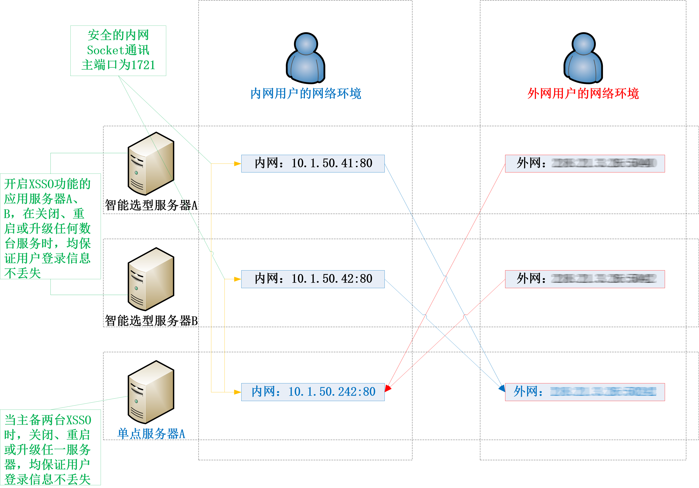

# XSSO

统一单点登陆验证服务
------

1. 特点：采用应用服务的登陆页面，单点登陆验证服务安安静静的提供服务，用户几乎察觉不出它的存在。多个不同种类的应用服务依然保留自己的登陆界面，同时还达到了单点登陆的功能。

2. 方便：无须域名、不挑端口(如80)，随便哪个端口都可以搭建单点服务。

3. 集群：可对单点登陆验证服务进行集群。其目的是为了安全，数台容灾用的备份服务器，并不是为了提高性能，它也没有多大的性能消耗，所以集群两台即可。

4. 会话数据是用于通讯的数据结构，它有三种方式。

   3.1 只保存票据，不保存会话数据；

   3.2 采用可通用可动态扩展的Map集合数据结构；

   3.3 采用专属数据结构，将应用服务上的会话数据Java类，打成jar包的方式或直接复制源码的方式放进来即可。

5. 经实测：

   3.1 集群中所有单点登陆验证服务因断电等原因均故障时，不影响应用服务器正常登陆的。

   3.2 集群中某一台单点登陆验证服务故障重启后，故障前的会话数据不丢失，对于故障前、后已登陆的用户依然保证单点登陆的能力。

   3.3 应用服务器故障重启后，从单点登陆验证服务同步会话数据后，依然保证故障前、后已登陆的用户有单点登陆的能力

6. 票据：由应用服务生成，可活动的个性化定制票据格式。同时，也有利于单点登陆验证服务无主从关系的集群架构。

7. 服务间通讯：采用Socket TCP通讯协议。的主端口为1821，浮动端口为17000~17999，均可在sys.ServerConfig.xml配置中修改。请保证服务器防火墙允许这些端口的通讯。

8. 监控页面(默认密码xsso)

➢ 在线会话数量 http://127.0.0.1:8080/XSSO/analyses/analyseObject?xid=USID*

➢ 在线会话的具体信息 http://127.0.0.1:8080/XSSO/analyses/analyseObject?xid=完整的票据号

➢ 配置文件重新加载页面(支持集群) http://127.0.0.1:8080/XSSO/analyses/analyseObject

➢ 查看集群服务及状态列表 http://127.0.0.1:8080/XSSO/analyses/analyseObject?cluster=Y

➢ 查看配置参数页面 http://127.0.0.1:8080/XSSO/analyses/analyseObject?xid=SYSParam

实战案例：吴忠仪表有限责任公司
------
XSSO单点服务器内外网络环境

---
#### 本项目引用Jar包，其源码链接如下
引用 https://github.com/HY-ZhengWei/hy.common.base 类库

引用 https://github.com/HY-ZhengWei/hy.common.file 类库

引用 https://github.com/HY-ZhengWei/hy.common.net 类库

引用 https://github.com/HY-ZhengWei/hy.common.tpool 类库

引用 https://github.com/HY-ZhengWei/XJava 类库
